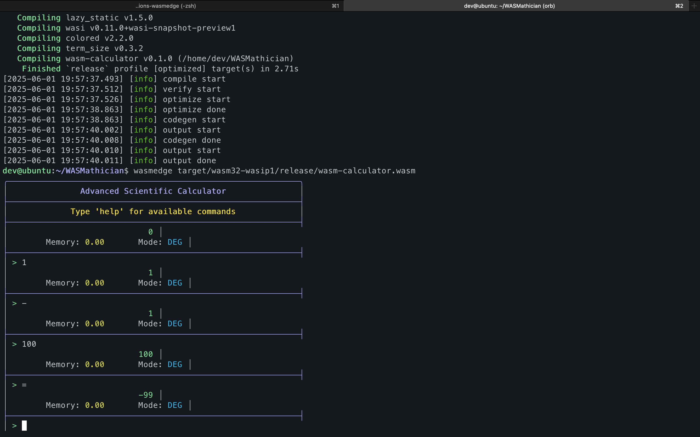
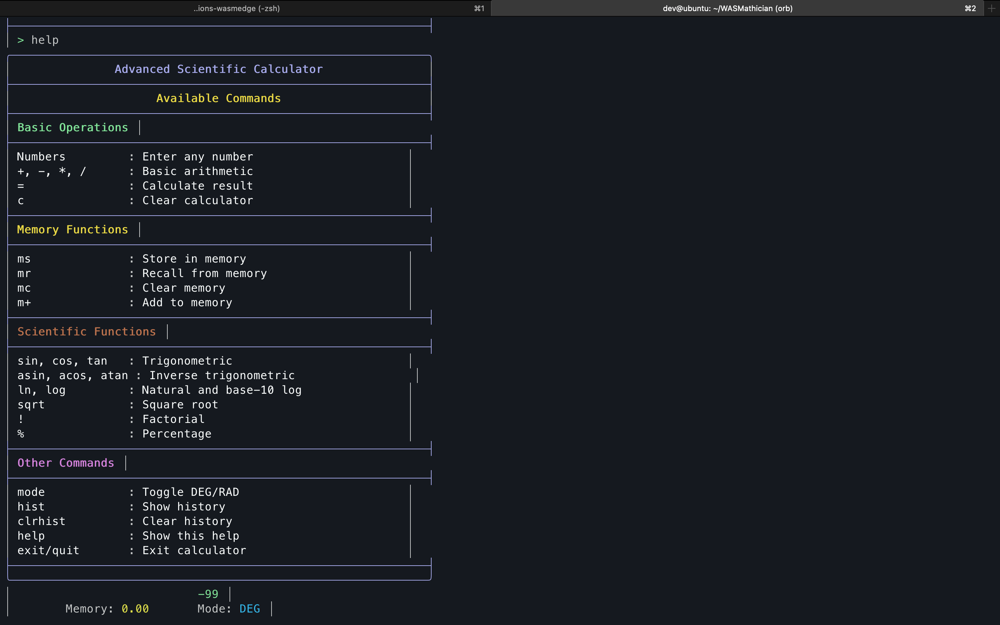

<h1 style="color:#ff5722">WASMathician</h1>

<span style="color:#ff9800"><b>A feature-rich calculator built with Rust and WebAssembly, with comprehensive mathematical capabilities</b></span>

## Features

- 🧮 Basic arithmetic operations 
- 📐 Trigonometric functions 
- 📊 Scientific operations 
- 💾 Memory functions 
- 📜 Calculation history tracking
- ⚡ WebAssembly support because it's great

## Prerequisites
- [Rust](https://www.rust-lang.org/tools/install)
- [WasmEdge Runtime](https://wasmedge.org/docs/start/install) (optional; other wasm runtimes can also be used)

## Installation

1. **Clone the repository:**
   ```bash
   git clone https://github.com/vatsalkeshav/WASMathician.git
   cd wasm-calculator
   ```

2. **Build for WebAssembly:**
   ```bash
   # Add wasm32-wasip1 target
   rustup target add wasm32-wasip1
   
   # Build for WebAssembly
   cargo build --target wasm32-wasip1 --release
   
   # Optional: Create AOT-compiled version for better performance
   wasmedgec target/wasm32-wasip1/release/wasm-calculator.wasm calculator.wasm
   ```

## Usage

### WebAssembly Execution
```bash
# Regular WebAssembly execution
wasmedge target/wasm32-wasip1/release/wasm-calculator.wasm

# Or run the AOT-compiled version (said to be faster)
wasmedge calculator.wasm
```

### Available Commands

#### **Basic Operations**
- **Numbers:** `any number`
- **Operators:** `` + ``, `` - ``, `` * ``, `` / ``, `` ^ ``, `` root ``
- **Calculate:** `` = ``
- **Clear:** `` c ``

#### **Memory Functions**
- **Store:** `` ms ``
- **Recall:** `` mr ``
- **Clear memory:** `` mc ``
- **Add to memory:** `` m+ ``

#### **Scientific Functions**
- **Trigonometric:** `` sin ``, `` cos ``, `` tan ``
- **Inverse trig:** `` asin ``, `` acos ``, `` atan ``
- **Logarithmic:** `` ln ``, `` log ``
- **Other:** `` sqrt ``, `` ! ``, `` % ``

#### **Other Commands**
- **Toggle angle mode (radian/degree):** `` mode ``
- **Show history:** `` hist ``
- **Clear history:** `` clrhist ``
- **Show help:** `` help ``
- **Exit:** `` exit ``, `` quit ``

## Images

<p align="center">
  
  
</p>

## Dependencies

- `colored`: Terminal colors and formatting
- `term_size`: Terminal size detection
- `wasi`: WebAssembly System Interface
